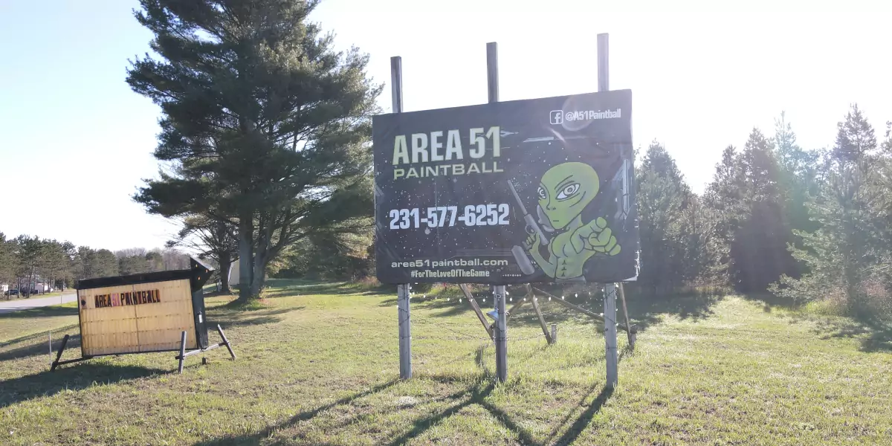
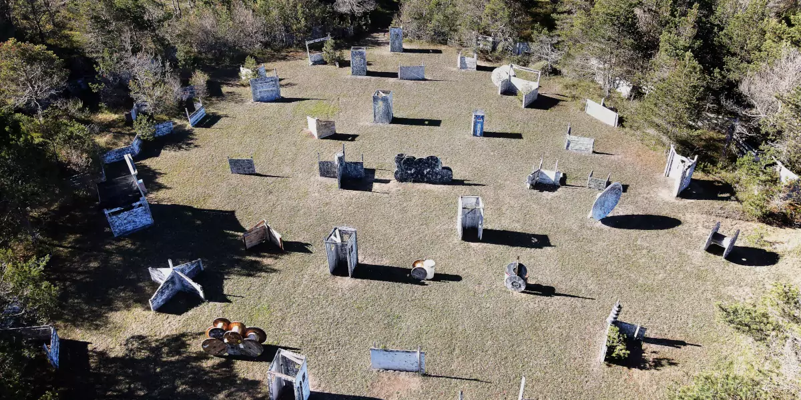
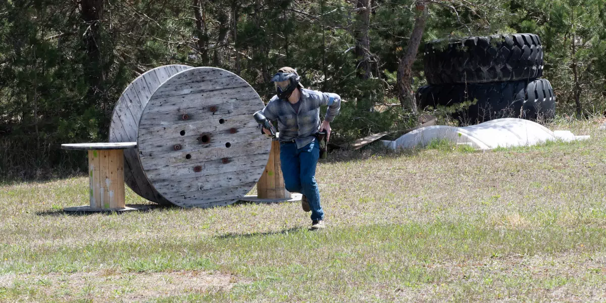
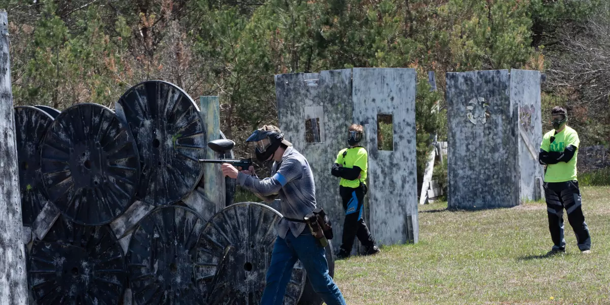
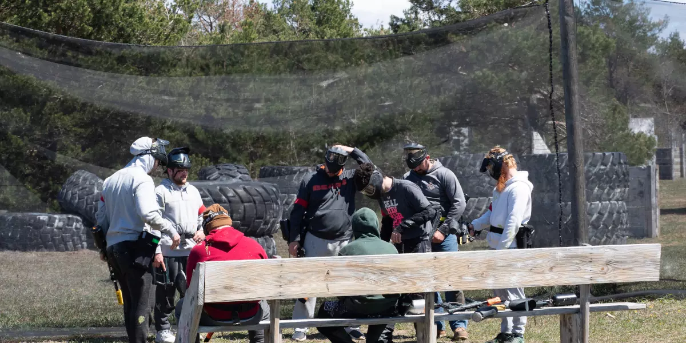

## No More Boring Weekends

 Located in the beautiful northwest Michigan, Area 51 Paintball Center is the ultimate outdoor paintball experience. Not only do we have a world-class facility, but we also offer top of the line equipment and safety gear so that you can get the most out of your day with us. We are not only a paintball field; we also offer events like corporate outings, birthday parties, bachelor and bachelorette parties, youth camps and more!

## What Is Paintball?

Paintball is a fast growing sport for adventure seekers. You can play paintball as a team or individually. It is one of the fastest sports in the world, played outdoors in terrain that offers the player a variety of options to choose from when it comes to strategy. There are many different types of paintball games and each game requires participants to have their own specific gear and equipment

## Why Play Paintball?

Paintball is a sport that is played like real combat. Your physical fitness, stamina, and endurance are tested. The game is also great for sharpening your analytical and tactical skills.

A player’s overall fitness plays an important role in his performance during the game. A player who is fit and has stamina can stay longer in the field and engage in more tactical moves and strategies. As paintball involves running, dodging, crawling, and shooting, it definitely helps improve overall fitness of a person.

Paintball uses teamwork bringing out the best in players. Paintball is a game which requires maximum mental concentration and an ability to be adaptable. It is a game that helps you stay healthy, as it is a fantastic cardio exercise. It will also improve your analytical and tactical skills in life, as it is a game of strategy.

Not only does paintball help you stay fit, but it develops your leadership skills. It also helps you relax after a hard day or week of work.

## Is Paintball Safe?

The modern game of paintball began in 1981 as a training exercise for military forces. It soon became popular with civilians, however, and is now played by millions of people around the world each year. Paintball has been called one of the safest sports on Earth, but safety precautions are always necessary when playing.

Is paintball a safe sport to play?  Paintball injuries are rare and we provide all of the safety equipment you need.   We believe that paintball is one of the safest sports on earth. In fact, it's probably safer than many more popular sports. For example, you're less likely to be injured playing paintball than football or ice hockey.

Paintball is a very safe sport because most injuries are due to mistakes in how the game is played. This means that most injuries can be prevented by following proper safety precautions.

Your safety gear is an important way to prevent injuries while you play. Paintball masks and chest protectors are designed and tested to give you the best protection available while still allowing you to safely play the game.  

## Where Should I Play Paintball? 

Although there are many similarities between indoor and outdoor paintball fields, the differences outweigh them. For one thing, an outdoor paintball field is obviously outdoors and therefore has greater visibility. The playing area on an outdoor field can be natural or it can be constructed by adding bunkers with artificial cover. It also makes use of natural terrain features such as hills and mud pits to add realism to the game.  Indoor fields and centers are great for those who want a very consistent experience each time since weather and the seasons do not factor into the game as much.  

## Area 51 Paintball Center is northwest Michigan's premier outdoor paintball center! 

 Paintball is a fun and exciting sport that can be challenging and rewarding.  If you are looking for an exciting activity that is easy to get started with, call Area 51 Paintball Center today at 231-577-6252 to speak with a member of our staff and set up your next outdoor adventure! We look forward to hearing from you soon.
